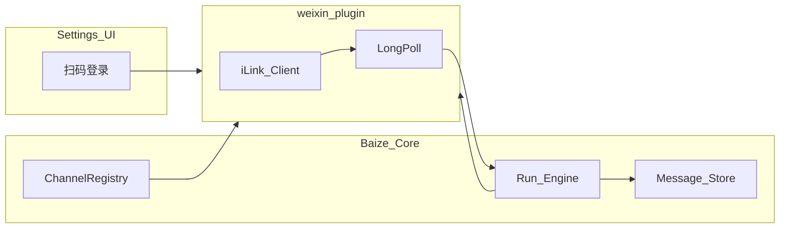

# 微信 Channel（iLink）与会话归属 v0 设计规格

> 状态：已批准（2026-08-29）  
> 日期：2026-08-29  
> 前置：会话持久化、附件/vision、控制面 Gate、Inbox（对照用）、SQL 驱动可插拔（P4）  
> 依据：头脑风暴——对齐 OpenClaw/Hermes 个人微信体验；Channel 插件化；具名操作员 + 会话 owner；设置页扫码；文本+媒体；`/ui`↔微信双向同步（权限内）  
> 路线：本里程碑 →（排队）X1 对外暴露 / X2 UI 切模型 / X3 中间件多源 / F 生产硬化  

---

## 1. 目标与成功标准

**目标：** 以腾讯 **iLink Bot** 将个人微信作为一等 **Channel 插件**接入 Baize（体验对齐 OpenClaw / Hermes：扫码登录、长轮询私信、媒体收发）；同时引入 **具名操作员** 与 **会话归属**，使 `/ui` 默认互不可见，admin 可看全部。开发阶段允许清空重建数据。

**成功标准：**

1. Channel 注册表可注册 `weixin`；设置页完成扫码登录；凭证落盘；进程启动自动恢复长轮询。  
2. 私信文本与图片/常见文件可入站进 Run（附件 + 既有 vision/降级路径），助手文本与附件可出站回微信。  
3. peer → 稳定 `conversation_id`；同 peer 存在 active Run 时不建第二 Run，微信侧提示稍候。  
4. 配置多个具名 operator；会话带 `owner_id`；`GET /v0/conversations` 默认仅本人；admin 可查看全部（本版可用查询参数或 UI 开关，正式统计页非本里程碑）。  
5. 对有权限打开的会话，`/ui` 与微信 **双向同步**（任一侧发言进入同一消息历史；UI 侧回复经 Channel 推送微信）。  
6. Gate 未配置口令 = **开发态**：行为等同单一本地 admin，**无**多运营隔离，文档明示；要隔离必须配置具名操作员。  
7. 假 iLink 单测覆盖登录态机、peer 隔离、媒体入库、归属过滤；真机扫码为手工验收。

**明确不做：**

| 项 | 原因 |
|----|------|
| 公众号服务器回调 | 非本里程碑产品形态 |
| 企微 / 钉钉实现 | 同契约后续插件 |
| 普通微信群 | iLink bot 通常不推群；默认关闭并文档说明 |
| 非官方个人号协议 | 合规与稳定性 |
| 依赖 OpenClaw 双运行时 | 白泽内一等 Channel |
| 企业 SSO / 多租户组织树 | 开源首版边界外 |
| 微信用户登录 `/ui` | 终端用户无白泽账号 |
| CLI 扫码 | 本版仅设置页；CLI 可后续 |
| 正式运营统计大屏 | 后做；admin 列表「全部」即可 |

---

## 2. 与 Inbox 的分工

| | Inbox | Weixin Channel |
|--|--------|----------------|
| 场景 | 告警 / 工单 / 自建网关 | 人在个人微信私信 bot |
| 鉴权 | Channel Secret HMAC | iLink 扫码 token |
| 传输 | 调用方 HTTP POST | 长轮询 + send |
| 会话键 | `external_id` 等 | `weixin:<account_id>:<peer_id>` |

Inbox **保留**；微信入站不强制走 HMAC Inbox。

---

## 3. Channel 插件架构



- `RegisterChannel(name, factory)`；本版交付 `weixin`。  
- 生命周期：`Start(ctx)` / `Stop`；入站规范化后调用 Runtime 开/续会话并 `CreateRun`；出站 `SendText` / `SendMedia`。  
- 配置：绑定 `agent_id`、可选 skills、DM 策略（`open` | `allowlist`）、微信会话默认受理人（operator id）、凭证目录。  
- 企微/钉钉等后续实现同一接口，不改核心查表逻辑（对齐 SQL 驱动注册表思路）。

---

## 4. 登录与凭证

- **设置 → 渠道 / 微信**（admin）：  
  - `POST /v0/settings/channels/weixin/login/start` → 二维码（URL 或图像）+ ticket  
  - `GET /v0/settings/channels/weixin/login/status` → `pending` | `success` | `expired`  
  - 登出：清除本地凭证并 `Stop`  
- 成功后 token / account_id 写入本地状态目录（如 `./data/channels/weixin/`），**不进 git**。  
- 启动时若凭证有效则自动 `Start` 轮询。  
- 仅 admin 可登录/登出微信账号。

---

## 5. 消息、媒体与并发

**入站**

1. 长轮询 getupdates。  
2. 解析文本与媒体；媒体经协议要求的 CDN/解密后写入会话附件。  
3. 映射 `conversation_id`；若 `HasActiveRun` → 回复「请稍候，上一轮还在处理」且不建新 Run。  
4. 否则 `CreateRun`（挂 `conversation_id`、附件）；vision 开启则图片进模型，否则文本说明 + 附件正文路径（与现 Chat 附件语义一致）。

**出站**

- Run 产生的助手文本与附件经插件发回；回显 iLink 所需 `context_token` 等字段。  
- 过大文件截断并提示。  
- 语音：尽力支持（可作文件）；失败则友好提示。

**群：** `group_policy` 默认 `disabled`；文档说明 iLink bot 限制。

---

## 6. 具名操作员与会话归属

### 6.1 控制面

配置支持多个操作员，例如：

```yaml
control_plane:
  admin_token: "env:BAIZE_ADMIN_TOKEN"
  operators:
    - id: alice
      token: "env:BAIZE_OP_ALICE"
    - id: bob
      token: "env:BAIZE_OP_BOB"
```

兼容：若仍只配单个 `operator_token`（无 `operators` 列表），视为唯一操作员 `id=operator`。  
`GET /v0/me` 返回 `role` 与 `operator_id`（admin 无 operator_id 或为 `admin`）。

**Gate 关闭**（双口令皆空且无 operators）：开发态，UI 仍按 admin 渲染；会话 `owner_id` 可写 `local-dev`；**文档必须写明无多运营隐私**。

### 6.2 会话元数据

引入会话登记（新表或等价存储），至少：

| 字段 | 说明 |
|------|------|
| `id` | `conversation_id` |
| `owner_id` | 操作员 id 或 `channel:weixin` / `local-dev` |
| `source` | `ui` \| `weixin` \| … |
| `title` | 可展示名（如微信 peer 备注） |
| `updated_at` | 排序 |

`GET /v0/conversations`：

- operator：仅 `owner_id == 自己`  
- admin：默认全部；或 `?scope=mine|all`（实现任选一种，UI 提供「全部」）。  

读取/写入消息、建 Run：校验当前身份对 `conversation_id` 有权，否则 403。

新建 `/ui` 会话：`owner_id = 当前 operator_id`（开发态 = `local-dev`）。

### 6.3 微信会话归属

设置项 **「微信会话受理人」**（operator id，可改）：

- 新 peer 首条消息创建会话时：`owner_id = 受理人`（若未配置则 `channel:weixin`，仅 admin 默认列表可见，避免摊给所有 operator）。  
- 推荐生产：指定受理人 + DM allowlist。

### 6.4 双向同步

- 同一 `conversation_id` 共享 `messages`。  
- `/ui` 在该会话发言 → Run → 若 `source=weixin`（或会话绑定了 weixin peer）则 Channel 出站到对应 peer。  
- 无权打开该会话的操作员看不到历史，也无法从 UI 向该微信线发言。

---

## 7. API / UI 摘要

| 能力 | 要求 |
|------|------|
| 微信登录/状态/登出 | admin；见 §4 |
| 渠道设置（agent、allowlist、受理人） | admin |
| 会话列表过滤 | 按 §6 |
| 聊天页 | 展示归属内会话；标题可含渠道前缀 |

与「插件（HTTP Connector）」分栏：**渠道** ≠ **工具插件**。

---

## 8. 测试与文档

- 单测：mock iLink HTTP；登录；双 peer 隔离；active Run；媒体附件；operator 列表过滤与 403。  
- 手工：扫码、手机私信文本/图片、`/ui` 同会话往返、第二操作员不可见。  
- README：微信 Channel 说明、Gate/具名操作员、开发态无隔离、群限制、与 Inbox 分工。  
- 更新开源边界笔记：本项入本版开发队列。

---

## 9. 验收对照

| # | 项 |
|---|-----|
| A | 设置页扫码后私信文本往返 |
| B | 图片/文件入站可进 Run，出站回到微信 |
| C | 两操作员互不可见对方 `/ui` 会话 |
| D | admin 可看全部 |
| E | 微信 peer 会话按受理人/规则归属；无权者 403 |
| F | 有权会话 `/ui`↔微信双向同步 |
| G | Gate 关时文档明示无隔离 |

---

## 10. 风险与后续

| 风险 | 缓解 |
|------|------|
| iLink 协议变更 | 插件内聚；假服务测契约 |
| 误开 Gate 空配置上生产 | README 生产清单强制具名操作员 |
| 媒体/CDN 复杂度 | 先图片+常见文件；语音尽力 |
| 多实例抢同一 bot | 本版单实例文档约束 |

**后续：** 企微/钉钉 Channel 插件、CLI 登录、统计页、X1/X2/X3、F。
